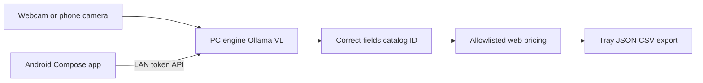

# Coin Tray

**Local-first coin identification and pricing** — sort a mixed box with on-machine vision models, allowlisted market comps, and an optional Android camera companion. No cloud AI billing; photos stay on your LAN.

> Built a local-first coin sorting system: Ollama vision ID, allowlisted market pricing with citations, structured catalog baggie IDs, and a Kotlin/CameraX Android companion over a LAN API.

## Why

Working through a junk box needs a quick ID and a rough value without uploading every photo to a cloud model. Coin Tray runs **Ollama vision locally**, lets you correct DATE / country / type in hand, stamps a **catalog baggie ID**, then prices from **allowlisted** guides and marketplaces with citations.

## Architecture

| Layer | Role |
|-------|------|
| `coin_desktop.py` + `coin_camera.py` | Tk desktop: live webcam, read/price, tray |
| `coin_engine.py` | Ollama VL, search, allowlisted extraction |
| `coin_tray.py` | LAN HTTP API for phone / browser (`:8722`) |
| `android/` | Kotlin Compose + CameraX thin client |

Details: [docs/ARCHITECTURE.md](docs/ARCHITECTURE.md) · Operator guide: [docs/OPERATOR.md](docs/OPERATOR.md) · One-page brief: [docs/PROJECT_BRIEF.md](docs/PROJECT_BRIEF.md) ([PDF](docs/Coin_Tray_Project_Brief.pdf)) · [Publish checklist](docs/PUBLIC_RELEASE.md)

## Stack

Python 3 · Tk · OpenCV · Ollama (vision + text) · Kotlin · Jetpack Compose · CameraX

## Quick start

### Desktop

1. Install [Ollama](https://ollama.com) and pull a vision model, e.g. `ollama pull qwen3-vl:8b` (or `gemma3:4b` on lighter hardware).
2. `pip install -r requirements.txt`
3. `python coin_desktop.py`

### Phone + PC

1. On the PC: start Ollama, then `python coin_tray.py` (or `start_phone_server.bat`).
2. Copy the printed **Phone URL** (`http://YOUR_LAN_IP:8722`) and **Token**.
3. Open `android/` in Android Studio (JDK 17 or 21), run on a phone on the **same Wi‑Fi**.
4. App **Settings** → paste URL + token → **Save & ping PC**.

Full steps: [android/README.md](android/README.md) and [docs/OPERATOR.md](docs/OPERATOR.md).

## Features

- Local vision ID (front/back), human correction loop
- Catalog IDs like `CA-0007 · U · 1964 25c Ag`
- Allowlisted pricing (PCGS/NGC, auctions, marketplaces) with range, sold vs ask, sources
- Face skip for obvious commons; IN HAND authenticity checklist
- Android companion: capture, read, price, tray pull/push over LAN
- Atomic tray saves + rotating backups (local files, not in git)

## Non-goals

- Not a substitute for professional grading or appraisal
- Not financial advice — ranges are comps, not “true” values
- On-device phone ID is stubbed; v1 still needs the PC for Ollama

## Security (LAN companion)

- Server binds `0.0.0.0:8722` for home Wi‑Fi only — **do not port-forward** to the internet
- Auth is the `X-Coin-Tray-Token` **header only** (query-string tokens are rejected)
- Cleartext HTTP is intentional for local use; keep the PC and phone on a private network
- Token lives in `coin_tray_config.json` (gitignored) and Android SharedPreferences (`allowBackup=false`)
- Copy [`coin_tray_config.example.json`](coin_tray_config.example.json) for settings without a token

## License

[MIT](LICENSE)

## Disclaimer

Photos cannot show edge, luster, or surface the way a grader does. Never clean a coin. If something looks valuable, get it authenticated before selling.
