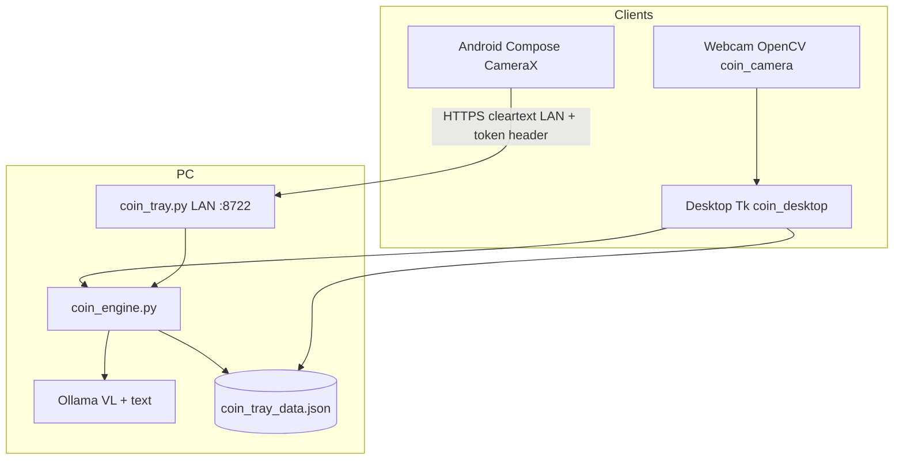

# Architecture

Coin Tray is a **local-first** pipeline: capture on desktop or phone, identify and
price on the PC, persist a shared tray JSON beside the repo (gitignored).

## System diagram

## Data flow

1. **Capture** — Webcam ROI crop (green guide) or phone JPEG wells (front/back).
2. **Read** — Base64 images → Ollama vision → side observations + soft identity guess.
3. **Correct** — Operator edits DATE, mint, country, series, grade, STATUS, catalog ID.
4. **Price / Face skip** — Allowlisted HTTP fetch + model extraction, or face-value bag.
5. **Tray** — Append entry; atomic write + rotating `coin_tray_backups/`.

## LAN API (`coin_tray.py`)

| Method | Path | Auth | Purpose |
|--------|------|------|---------|
| GET | `/api/health` | no | Liveness + Ollama status (no token returned) |
| GET | `/api/models` | token | Vision / pricing model names |
| POST | `/api/read` | token | Identify from obverse/reverse JPEGs |
| POST | `/api/price` | token | Price from attribution (+ optional images) |
| POST | `/api/face-skip` | token | Face / common without web search |
| GET/PUT | `/api/tray` | token | Pull or push tray JSON |

Auth: `X-Coin-Tray-Token` header only. Bind is `0.0.0.0` for LAN phones; do not
expose the port publicly. Cleartext HTTP is intentional for home Wi‑Fi.

## Android companion

Package `com.cointray.app`: Compose UI, CameraX preview, torch / 1×–2× zoom,
guide-circle crop, Settings pairing, Edit (STATUS, catalog), Tray pull/push.
Heavy work stays on the PC — the phone is a camera + keypad.

## Trust boundaries

| Asset | Location | Public repo? |
|-------|----------|--------------|
| Source code | git | yes |
| Tray inventory + photo thumbs | `coin_tray_data.json` | **no** (gitignored) |
| Phone token | `coin_tray_config.json` / device prefs | **no** |
| Sample captures | `samples/` | **no** |
